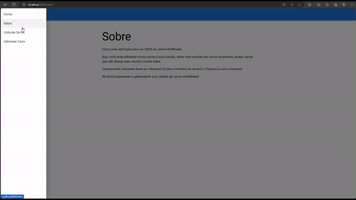
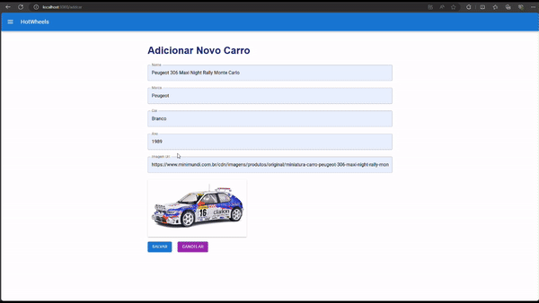

# CRUD Hotwheels

O CRUD Hotwheels é um aplicativo para criar e gerenciar uma lista de carrinhos Hotwheels.

## Índice

- [Modo de Utilização](#modo-de-utilização)
- [Uso](#uso)
- [Contato](#contato)

## Modo de Utilização

Para clonar e executar este aplicativo, você precisará do Git, Node.js (que inclui npm) instalados no seu computador e certificar-se de que a API necessária esteja rodando para exibir a lista de carrinhos.

### Clonar o Repositório

```bash
$ git clone https://github.com/alanledur1/CRUD-de-carros-hot-wheels.git

Instalar Dependências e Executar o App

No diretório do App:
$ cd hotwheels
$ npm install
$ npm start

Instalar Dependências e Executar a API

No diretório da API:
$ cd hotwheel-api
$ npm install
$ npm start
```


### Uso

Este aplicativo permite:

- Adicionar novos carrinhos Hotwheels à lista.
- Visualizar a lista de carrinhos Hotwheels existentes.
- Excluir carrinhos Hotwheels da lista.

### Exemplos de Uso

- Excluindo carro da lista:

  
 
  

- Tentativa de adicionar carro sem preencher os campos:
  
 


- Adicionando um carro:
  


## Contato

- Nome:`Alan Ledur` 
- E-mail: `alanledur01@gmail.com`
